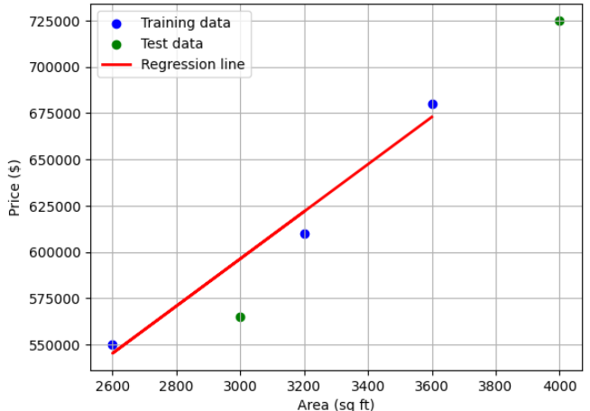

# house_price_prediction
A simple linear regression model predicting house prices based on area using Python and Scikit-learn.
# 🏠 House Price Prediction Using Linear Regression

This project uses **Linear Regression** to predict house prices based on area (in square feet).

## 📊 Steps
1. Data loading and exploration  
2. Feature selection (`area` as predictor, `price` as target)  
3. Train-test split  
4. Model building using Scikit-learn  
5. Evaluation using MAE, MSE, RMSE, and R² Score  
6. Visualization of regression line vs actual data  

## 🧮 Example Metrics
| Metric | Value |
|--------|--------|
| MSE | 490893351.800556 |
| RMSE | 22156.113192537992 |
| R² | 0.92 |

## 📈 Visualization

## 🧰 Tools Used
- Python
- Pandas
- Scikit-learn
- Matplotlib
- Google Colab

---

👩‍💻 Created by Ann Kiarie
